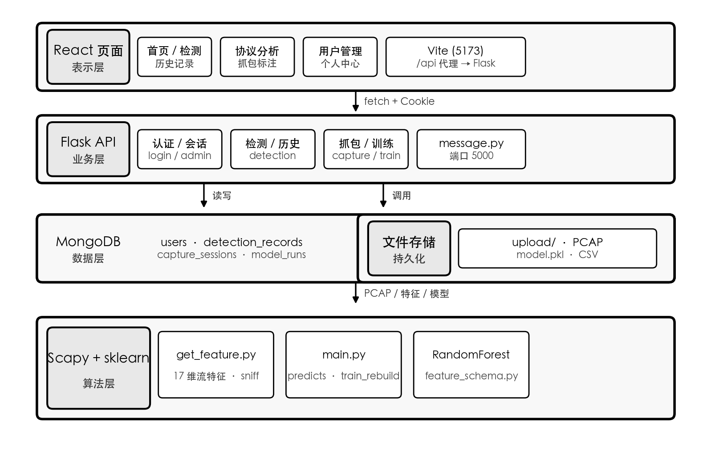

# 毕业设计论文正文（请复制到《青岛理工大学.docx》目录之后）

> **使用说明**  
> 1. 文中 `【图×-×】` 处请运行系统后自行截图插入（已标明页面与操作）。  
> 2. 参考文献共 **15** 篇（2020 年以后为主，外文期刊 ≥3，书籍 ≤1）；正文 **[1]～[15]** 按**首次出现顺序**编号，在 Word 中设为上标。  
> 3. **摘要、第7章、结论**中不写文献引用（学校要求）。你 docx 里的中英文摘要也请删掉引用标注。  
> 3. 架构图、流程图可用 Word 插入 → SmartArt，或根据各节文字描述绘制。  
> 4. 将本文件各章粘贴到原 docx 对应章节位置，并更新目录页码。

---

## 第1章 绪论

### 1.1 研究背景

随着云计算、物联网与移动互联网的快速发展，网络流量规模持续增长，恶意扫描、僵尸网络、DNS 隧道与加密 C2 通信等威胁形态更加隐蔽[1]。在安全运营与教学实验中，分析人员常需对 PCAP 报文进行协议解析与行为研判；若完全依赖人工逐包查看，不仅效率低下，而且难以在大样本场景下保持结果一致。机器学习通过对流级统计特征进行建模，可在一定程度上实现自动分类，已成为入侵检测与流量分析的重要技术路线[2]。

Python 生态中的 Scapy 库为报文构造与解析提供了灵活接口[3]，便于从原始 PCAP 提取自定义特征；scikit-learn 则提供了包括随机森林在内的成熟分类算法及评估工具[4]。将二者与 Web 平台结合，形成「抓包—标注—训练—检测—归档」闭环，对网络安全专业实践教学具有现实意义。基于此，本文设计并实现了基于 Scapy 与随机森林的网络流量分析系统。

### 1.2 研究目的与意义

本课题旨在设计一套前后端分离的恶意流量检测平台，实现以下目标：（1）支持用户上传 PCAP 并完成基于 17 维流特征的自动判别；（2）支持检测结果的持久化存储与历史查询；（3）为管理员提供实时/离线抓包、会话标注、模型重训与版本恢复能力；（4）提供用户与权限管理，区分普通用户与管理员角色。

研究意义体现在：其一，将分散的脚本式分析流程 Web 化，降低使用门槛；其二，通过可解释的流级特征与随机森林模型，兼顾教学演示与实验复现；其三，为后续扩展更多算法或特征维度预留接口。

### 1.3 国内外研究现状

国外研究方面，Getman 等对基于机器学习的网络流量分类方法、特征选择与常用数据集进行了系统梳理[5]；Azab 等综述了端口识别、深度包检测、统计特征与机器学习相结合等路线，并分析了公开数据集与加密流量带来的挑战[6]。Salman 等进一步指出，动态端口、隧道与加密应用使得传统识别方法面临局限，流级统计特征与监督学习仍是重要研究方向[2]。

国内研究方面，唐政治等对机器学习在网络流量预测、识别与异常检测中的应用进行了归纳[1]；张东鑫等基于流量行为图与生成学习模型实现了多类攻击检测[7]；魏松杰等针对匿名流量特征设计并对比了随机森林等分类器的效果[8]；顾兆军等研究了恶意网络流量分类算法[11]。在加密流量检测方向，Alshamrani 等基于精细会话分析开展了恶意加密流量识别研究[12]。工程实践上多采用 Scapy 等工具完成报文解析，再结合 Web 框架构建检测服务[3][9]。现有工作或多侧重离线算法实验，或缺少标注—重训—上线检测的一体化平台。本文在借鉴流级特征与随机森林思路的基础上，强调完整业务闭环与权限隔离。

### 1.4 论文组织结构

全文共分七章：第1章为绪论；第2章进行需求与可行性分析；第3章给出系统概要设计；第4章描述数据设计；第5章阐述详细设计与实现；第6章介绍系统测试；第7章总结全文并展望后续工作。论文第 4 章侧重数据与特征的形式化描述，第 5 章结合源程序说明关键模块实现，第 6 章给出可复现的测试用例与截图位置，便于评阅教师对照系统验收。

### 1.5 开发环境与工具

本系统在 PyCharm 中组织 Python 后端工程，使用 Python 3 虚拟环境管理依赖，通过 `pip install -r requirements.txt` 安装 Flask、Scapy、scikit-learn 等组件；MongoDB 作为业务数据库在本地 27017 端口运行。前端工程位于 `traffic-platform-react` 目录，使用 Visual Studio Code 或 PyCharm 内置终端执行 `npm install` 与 `npm run dev`。版本控制采用 Git，忽略 `model.pkl`、`upload/`、`node_modules/` 等生成物。该环境与 README 中部署说明一致，保证论文描述与仓库可复现。

---

## 第2章 系统分析

### 2.1 需求分析

根据任务书与系统实际实现，本节从系统边界、角色用例、功能模块与非功能要求四个方面说明需求。

#### 2.1.1 系统边界与角色划分

本平台面向授权实验网络内的 PCAP 离线或实时分析，不替代防火墙、入侵检测系统等生产级安全设备；模型判别结果仅作辅助研判，最终处置须结合业务场景与人工复核。用户分为普通用户与管理员两类：普通用户侧重上传检测与历史查询；管理员在具备普通用户能力的基础上，承担抓包、标注、模型重训与用户运维等职责。全部功能通过浏览器访问，无需安装独立客户端。

从用例角度看，普通用户的核心用例包括注册登录、上传 PCAP 检测、查看历史；管理员在此基础上增加网卡抓包、会话标注、触发重训、查看特征说明与训练指标、恢复历史模型、管理用户账号等用例。角色与功能的对照关系见表 2-1。

表2-1 系统角色与功能对照表

| 功能 | 普通用户 | 管理员 |
|------|:--------:|:------:|
| 注册/登录 | √ | √ |
| PCAP 上传检测 | √ | √ |
| 历史记录 | √ | √ |
| 实时/离线抓包 | × | √ |
| 会话标注与模型重训 | × | √ |
| 用户管理 | × | √ |

#### 2.1.2 用户端功能需求

用户端功能涵盖认证、流量检测与历史记录三部分，面向所有已登录且账号状态正常的用户。

在认证方面，系统提供注册、登录、登出与会话校验。用户名长度限制为 3～10 个字符，密码为 6～16 个字符；系统中首个注册用户自动获得管理员角色。账号状态分为 active（正常）与 blocked（封禁），封禁用户无法登录，也无法调用检测、历史等业务接口。

在流量检测方面，用户可上传扩展名为 .pcap 的文件，单文件大小不超过 10MB。服务端将文件保存至上传目录后，调用 GetFeature 提取流级特征，再使用 model.pkl 中的随机森林模型进行预测：若任意一条流被判定为恶意（标签 0），则整包结论为“危险”，否则为“安全”。接口同时返回 TCP、UDP、ICMP、ARP、HTTP 等协议数量统计与检测耗时，并将结果写入 MongoDB 的 detection_records 集合。

在历史记录方面，用户可按时间查看本人的检测记录，内容包括文件名、判别结果、协议分布、包总数、耗时等字段，便于对比与追溯。

#### 2.1.3 管理员功能需求

管理员功能包括抓包协议分析、模型训练与用户管理，仅对 role 为 admin 的账号开放。

抓包协议分析支持选择网卡进行实时抓包（可选 BPF 过滤）、暂停、继续、停止，以及离线打开 PCAP 文件；提供包列表、单包详情查看与 SSE 流式推送，并可管理抓包会话。停止抓包后，系统可将缓冲数据保存为 PCAP 文件并写入 capture_sessions 集合；管理员可对会话标注 normal（正常）或 malicious（恶意），供后续训练时合并样本。

模型训练在默认 goodx.csv、badx.csv 数据集基础上，可选择合并已标注会话 PCAP 所提取的特征后重新训练。训练过程输出训练集与测试集准确率、混淆矩阵、恶意类 Recall 与 F1、特征重要性，以及与逻辑回归、决策树的基线对比。训练完成后更新 train_test/model.pkl，并将模型快照归档至 model_archive 目录；管理员还可按历史训练记录将某一版本恢复为当前线上模型。

用户管理支持按用户名搜索，查看各用户的检测提交次数与不重复 PCAP 数量，重置密码，以及封禁或解封账号（不可对当前登录的管理员本人执行封禁操作）。

#### 2.1.4 非功能需求

在非功能方面，系统采用前后端分离架构，便于模块维护与独立部署；业务数据使用 MongoDB 存储；开发阶段由 Vite 将前端的 /api 请求代理至 Flask 的 5000 端口；界面针对桌面浏览器进行布局适配，保证常用分辨率下可正常操作。

### 2.2 可行性分析

**技术可行性**：项目采用 Flask + React + MongoDB + Scapy + scikit-learn，均为成熟开源组件；特征提取与训练代码位于 `traffic_platform/train_test/`，与 Web 层通过 Python 模块导入衔接，已在本地完成联调。

**经济可行性**：全部软件可免费使用，部署于普通 PC 与本地 MongoDB 即可满足教学实验需求。

**操作可行性**：Web 界面提供首页 Bento 卡片导航、顶栏模块入口及表单化操作；管理员协议分析页集中抓包与训练功能，流程清晰。

### 2.3 数据流与信息流分析

从数据流角度看，系统存在三条主线。其一，**检测数据流**：PCAP 文件自浏览器进入 Flask 上传目录，经特征提取变为数值矩阵，再经模型推理得到离散标签，最终以 JSON 返回浏览器并异步写入 MongoDB。其二，**抓包数据流**：网卡报文进入 `capture_service` 内存队列，停止后序列化为 PCAP 文件，会话元数据写入 `capture_sessions`，标注信息仅更新文档字段而不移动文件。其三，**训练数据流**：CSV 与标注 PCAP 在训练函数内被统一转换为特征列表，标签向量与特征矩阵一同进入 `train_test_split`，评估指标与模型二进制一并写入磁盘与 `model_runs`。三条数据流在特征维度与 `FEATURE_NAMES` 上汇合，保证训练与推理一致。

从信息流角度看，普通用户仅可读取与自身 `username` 匹配的检测历史；管理员可读取本人抓包会话与训练记录，并在用户管理接口读取全体用户统计信息。密码字段在查询用户列表时被投影排除（`{'password': 0}`），降低敏感信息泄露风险。上述约束在控制器层通过 Session 中的 `username` 与 `role` 实施，而非仅依赖前端隐藏按钮，符合安全设计原则[10]。

### 2.4 本章小结

本章从角色划分出发分析了系统功能与非功能需求，补充了数据流与权限信息流说明，并从技术、经济、操作三方面论证了项目可行性，为后续概要设计与实现奠定基础。

---

## 第3章 系统概要设计

### 3.1 总体功能设计

系统采用 B/S 结构，分为**表示层**（React 单页应用）、**业务层**（Flask REST API）、**数据层**（MongoDB + 文件系统）与**算法层**（特征提取与随机森林）。表示层通过 `fetch` 携带 Cookie 访问 `/api/*`；业务层在 `message.py` 中集中定义路由与权限校验；算法层由 `get_feature.py`、`main.py` 完成特征与模型相关计算。

**图3-1 系统总体功能结构图**  
【请绘制或用 SmartArt：顶层「恶意流量检测平台」下分四个子模块：用户与权限管理、流量检测与历史、抓包与协议分析、模型训练与版本管理】

**图3-2 系统部署结构图**  
【请绘制：浏览器 → Vite(5173) 代理 → Flask(5000) → MongoDB(27017)；Flask 同时读写 upload/ 目录与 train_test/model.pkl】

### 3.2 系统工作流程

**（1）检测流程**  
用户选择 PCAP → `POST /api/detection` → 保存至 `upload/` → `analysis()` → `predicts_pcap()` → 写 `detection_records` → 返回 JSON → 前端展示结果。

**（2）训练流程**  
管理员触发 `POST /api/train/rebuild` → 收集标注会话 PCAP 路径 → `run_with_extra_pcaps()` → 训练随机森林 → 保存 `model.pkl` 与 `model_runs` 记录 → 归档模型快照。

**（3）抓包与标注流程**  
管理员选择网卡与 BPF 规则 → `capture/start` → 实时查看包列表 → `capture/stop` 保存会话 → 在会话列表标注 normal/malicious → 可选 `features-preview` 预览特征与当前模型逐流预测 → 触发 `train/rebuild` 合并样本。

**图3-3 流量检测业务流程图**  
【请绘制流程图：开始 → 登录 → 上传 PCAP → 特征提取 → 模型预测 → 写库 → 展示结果 → 结束】

**图3-4 模型训练与版本管理流程图**  
【请绘制：标注会话 → 合并 CSV 特征 → 训练 → 保存 model.pkl → 写入 model_runs → 归档 model_archive → 可选 restore 恢复】

### 3.3 系统非功能设计概要

在性能方面，检测耗时主要取决于 PCAP 大小与流数量，平台在响应中返回 `elapsed_time` 便于用户感知；抓包模块限制内存中缓冲包数量，停止后落盘释放内存。在安全方面，密码不以明文存储；管理员接口与普通接口分离；Session 依赖服务端密钥。在可维护性方面，特征名与模型版本写入 artifact，API `GET /api/train/feature-schema` 对外暴露特征语义，便于论文撰写与实验报告引用。

### 3.4 本章小结

本章给出了系统的分层功能结构与两条核心业务流程，明确了各层职责与协作关系。

---

## 第4章 数据设计

### 4.1 概念数据设计

系统主要实体包括：**用户**（User）、**检测记录**（DetectionRecord）、**抓包会话**（CaptureSession）、**模型训练运行**（ModelRun）。用户与检测记录为一对多关系；用户与抓包会话为一对多；训练运行记录与模型归档文件为一对一关联。

**图4-1 系统 E-R 概念图**  
【请绘制：用户 —1:N— 检测记录；用户 —1:N— 抓包会话；用户 —1:N— 模型训练记录】

### 4.2 数据库集合设计

数据库名由 `setting.py` 中 `MONGO_URI` 指定，默认为 `traffic_platform`。各集合主要字段如表4-1～表4-4所示（与 `message.py` 实现一致）。

**表4-1 users 集合字段说明**

| 字段名 | 类型 | 说明 |
|--------|------|------|
| _id | ObjectId | 主键 |
| username | string | 用户名，唯一 |
| password | string | Werkzeug 哈希密码 |
| role | string | `admin` / `user` |
| status | string | `active` / `blocked` |

**表4-2 detection_records 集合字段说明**

| 字段名 | 类型 | 说明 |
|--------|------|------|
| username | string | 检测用户 |
| filename | string | PCAP 文件名 |
| result | string | 「安全」/「危险」 |
| safe | bool | 是否安全 |
| protocols | object | TCP/UDP/ICMP 等计数 |
| total_packets | int | 包总数 |
| elapsed_time | float | 检测耗时（秒） |
| created_at | datetime | UTC 时间 |

**表4-3 capture_sessions 集合字段说明**

| 字段名 | 类型 | 说明 |
|--------|------|------|
| mode | string | 实时/离线模式 |
| bpf_filter | string | BPF 过滤表达式 |
| pcap_path | string | 会话 PCAP 路径 |
| packet_count | int | 包数量 |
| annotation | string | `normal` / `malicious` / null |
| started_at / ended_at | datetime | 起止时间 |

**表4-4 model_runs 集合字段说明**

| 字段名 | 类型 | 说明 |
|--------|------|------|
| train_score / test_score | float | 训练/测试准确率 |
| malicious_recall / malicious_f1 | float | 恶意类指标 |
| confusion_matrix | array | 混淆矩阵 |
| feature_importance | array | 特征重要性 |
| model_file | string | 归档相对路径 |

### 4.3 训练数据与模型文件设计

**（1）CSV 训练集**  
默认正样本 `train_test/dataset/goodx.csv`、负样本 `badx.csv`，由历史抓包脚本（`get_goodx.py`、`get_badx.py`）或管理员标注 PCAP 经 `GetFeature` 转换后合并得到。CSV 每行对应一条流的特征向量，训练时正样本标签全部为 1，负样本全部为 0。若某次重训勾选「合并已标注抓包」，则 `train_rebuild` 接口会遍历当前管理员名下 `annotation` 为 `normal` 的会话 PCAP 追加至正样本，为 `malicious` 的追加至负样本，实现小样本增量学习。

**（2）上传与抓包文件**  
用户检测上传文件保存在 `web_platform/upload/` 目录，文件名经 `secure_filename` 处理；抓包停止后生成 `capture_<username>_<timestamp>.pcap`，路径写入 `capture_sessions.pcap_path` 字段，供后续标注与训练引用。

#### 4.3.2 流级特征定义

特征名称由 `feature_schema.py` 中的 `FEATURE_NAMES` 统一定义，共 17 维：基础统计 5 维（包长均值、包长标准差、包间隔均值、包间隔标准差、未知端口占比）+ 协议计数 7 维（IP、UDP、DNS 应答、DNS 查询、IPv6、ICMPv6、TLS）+ 行为扩展 5 维（包总数、小包占比、最大包间隔、总字节数、不同端口对数）。标签约定：1 表示安全（normal），0 表示恶意（malicious）。

表4-5 流级特征一览表

| 序号 | 特征名 | 含义简述 |
|:----:|--------|----------|
| 1 | len_mean | 流内 IP 包长度均值；异常偏大或偏小可能对应隧道、分片或畸形流量 |
| 2 | len_std | 流内包长标准差；扫描、交互式 Shell 等常表现为高方差 |
| 3 | time_mean | 流内包间隔时间均值（秒） |
| 4 | time_std | 流内包间隔时间标准差 |
| 5 | num_unknown | 无法解析源/目的端口的报文占比 |
| 6 | IP | IPv4 相关报文计数 |
| 7 | UDP | UDP 报文计数 |
| 8 | DNS ANS | DNS 应答报文计数 |
| 9 | DNS Qry | DNS 查询报文计数 |
| 10 | IPV6 | IPv6 报文计数 |
| 11 | ICMPv6 | ICMPv6 报文计数 |
| 12 | TLS | TLS/加密会话相关报文计数 |
| 13 | packet_count | 该流包含的报文总数 |
| 14 | small_pkt_ratio | 小于 64 字节的报文占比 |
| 15 | iat_max | 流内最大包间隔（秒） |
| 16 | byte_total | 流内报文总字节数 |
| 17 | distinct_ports | 流内不同端口对数量 |

**（3）模型文件**  
`model.pkl` 由 joblib 保存，结构为 `{ "version": 2, "model": RandomForestClassifier, "feature_names": [...] }`。每次训练成功后将当前模型复制到 `model_archive/model_<run_id>.pkl`，供 `POST /api/train/restore` 恢复。

### 4.4 数据一致性与约束

为保证数据质量，系统在多个层次设置约束：注册时用户名唯一索引由应用层 `find_one` 与 MongoDB 唯一性共同保证；检测记录中的 `safe` 字段与 `result` 文本保持同步，避免前后端理解歧义；抓包会话标注仅允许 `normal`、`malicious` 或空值（清除标注），非法值返回 400；训练恢复时校验 `model_runs` 文档归属当前管理员且归档文件存在，防止越权恢复他人模型。特征向量在写入 CSV 或参与训练前，各维均为浮点数，协议计数维在流内累加，比例维归一化到合理区间，减少异常字符对模型的干扰。

### 4.5 本章小结

本章从概念模型、MongoDB 集合、特征与模型文件三方面完成了数据设计，并说明了数据一致性约束，为第 5 章实现提供结构化依据。

---

## 第5章 系统详细设计与实现

### 5.1 系统总体架构设计

后端入口为 `traffic_platform/web_platform/runserver.py`，应用实例在 `__init__.py` 中创建并加载 `setting.py` 配置。路由模块 `controller/message.py` 在导入时注册全部 API。前端入口为 `traffic-platform-react/src/main.jsx`，路由表定义于 `App.jsx`。

**图5-1 系统技术架构图**  

开发环境：PyCharm 管理 Python 工程；Node.js 运行 Vite[13]；MongoDB 本地 27017；`vite.config.js` 将 `/api` 代理至 `http://127.0.0.1:5000`。前端界面基于 React 构建[14]。

### 5.2 后端功能模块设计与实现

**（1）认证与权限**  
登录接口校验用户名密码及 `status` 字段，成功后写入 Flask Session。`_require_login_active()` 用于检测、历史等接口；`_require_admin()` 用于 capture、train、admin 接口，返回 403。

**（2）检测接口实现**  
`detection()` 接收 multipart 上传，调用 `analysis(pcap_path, csv_path)`。`analysis()` 内部执行 `predicts_pcap()`：先 `GetFeature().MakeFeatures(pcap)` 得到特征矩阵，再 `predicts()` 加载 `model.pkl` 并预测；若特征维度与模型 `n_features_in_` 不一致则抛出明确错误，提示需重训。

**（3）抓包服务**  
`capture_service.py` 使用 Scapy `sniff()` 在独立线程抓包，维护内存包列表与状态机（running/paused）。停止时将缓冲写入 `upload/capture_<user>_<timestamp>.pcap` 并插入 `capture_sessions`。

**（4）训练接口**  
`train_rebuild()` 根据标注会话收集 PCAP 路径，调用 `run_with_extra_pcaps()` 合并特征后执行 `_train_from_feature_lists()`。训练函数使用 `RandomForestClassifier(class_weight='balanced_subsample')`，划分训练/测试集并计算混淆矩阵、恶意类 P/R/F1 及 LR、决策树基线，最后 `joblib.dump` 保存。

**表5-1 主要 API 接口一览表**

| 方法 | 路径 | 说明 | 权限 |
|------|------|------|------|
| POST | /api/login | 登录 | 公开 |
| POST | /api/detection | 上传检测 | 登录 |
| GET | /api/detection-history | 历史 | 登录 |
| POST | /api/capture/start | 开始抓包 | 管理员 |
| POST | /api/train/rebuild | 模型重训 | 管理员 |
| GET | /api/admin/users | 用户列表 | 管理员 |

#### 5.2.1 流级特征提取实现

`GetFeature` 类是特征工程的核心。对于 PCAP 输入，`_make_features_from_pcap` 使用 Scapy 读取报文，以源 IP、目的 IP、源端口、目的端口、协议类型构成流键，将属于同一流的数据包聚合。对每条流统计：（1）IP 层负载长度序列的均值与标准差；（2）相邻包到达时间间隔的均值、标准差与最大值；（3）无法识别端口字段的报文占比；（4）TCP、UDP、DNS 查询/应答、IPv6、ICMPv6、TLS 等协议出现次数；（5）扩展维 `security_extra_features` 计算的包总数、小于 64 字节小包占比、流内总字节数及不同端口对数量。最终将每条流映射为 17 维实数向量，供训练与预测使用。该设计与 `feature_schema.py` 中 `FEATURE_NAMES` 顺序严格一致，避免训练与在线检测维度错位。

#### 5.2.2 随机森林训练实现

`train()` 函数将特征矩阵与标签按 7:3 划分训练集与测试集，优先使用分层抽样（`stratify=y`）以缓解类别不平衡。分类器配置为：`RandomForestClassifier(n_estimators=200, max_depth=100, criterion='gini', class_weight='balanced_subsample', n_jobs=-1)`，兼顾精度与多核训练效率；同类研究在流量分类实验中也验证了随机森林具有较高准确率[8]。训练完成后调用 `_evaluate_binary_classifier` 计算混淆矩阵及恶意类（标签 0）、安全类（标签 1）的 Precision、Recall、F1；并训练逻辑回归与决策树作为基线写入 `baseline_comparison`。特征重要性按 `feature_importances_` 降序取前 12 项返回前端展示。持久化时除模型对象外还保存 `version=2` 与 `feature_names`，便于后续兼容性检查。业务数据写入 MongoDB[15]，上传文件存放于服务端 `upload` 目录。

#### 5.2.3 抓包服务线程模型

`capture_service` 采用单例模式维护抓包状态。调用 `start(iface, bpf_filter)` 后，在后台线程执行 `sniff(iface=..., filter=..., store=False, prn=callback)`，回调函数将摘要信息（序号、时间、五元组、协议、长度）追加至内存列表，并可通过 SSE 向浏览器推送。`pause`/`resume` 通过事件量控制是否处理新包；`stop` 结束线程并允许将缓冲写入磁盘。离线模式 `load_offline` 直接 `rdpcap` 解析上传文件，逻辑与实时抓包共用列表与查询接口，降低前后端耦合。

### 5.3 前端界面与交互设计与实现

前端采用 React 函数组件 + React Router。`api.js` 封装 `apiUrl()` 与 `readJsonResponse()`，统一处理代理与 JSON 解析错误。

**（1）首页 Home**  
展示后端在线状态、本地时间、技术栈跑马灯（Scapy、随机森林、17 维特征等）。管理员采用 Bento 布局：抓包协议分析为 2×2 主卡，历史与流量检测为侧栏小卡，用户管理为底部宽卡。

**图5-2 管理员首页界面**  
【请截图：浏览器打开 http://localhost:5173/ ，管理员登录后的首页，含五张 Bento 卡片】

**（2）流量检测页 Detection**  
提供文件选择与上传按钮，展示判别结果、协议统计与耗时。

**图5-3 流量检测结果界面**  
【请截图：上传 sample.pcap 后的检测结果页】

**（3）协议分析页 ProtocolAnalysis**  
分区展示抓包控制、包列表、特征 schema、训练指标与历史 run 列表，支持模型恢复确认对话框。

**图5-4 协议分析与模型训练界面**  
【请截图：/analysis 页面，含抓包区与训练指标区】

**（4）用户管理页 AdminUsers**  
表格展示用户列表，支持搜索、改密与封禁操作。

**图5-5 用户管理界面**  
【请截图：/admin/users 页面】

**（5）历史记录页 History**  
列表或图表展示当前用户检测记录。

**图5-6 历史记录界面**  
【请截图：/history 页面】

**（6）登录注册页**  
`Login.jsx` 与 `Register.jsx` 通过 JSON 调用 `/api/login`、`/api/register`，成功后跳转首页；注册时首个用户自动获得管理员角色，与后端 `user_count` 判断逻辑一致。

**图5-7 登录界面**  
【请截图：/login 页面】

#### 5.3.1 前后端数据交互说明

前端所有受保护请求均设置 `credentials: 'include'` 以携带 Session Cookie。检测页使用 `FormData` 上传文件，不手动设置 `Content-Type`，由浏览器自动添加 boundary。协议分析页对训练指标、特征 schema 等接口采用 `readJsonResponse` 统一解析，避免将 Vite 返回的 HTML 错误页当作 JSON 解析。该设计在开发阶段可有效区分「后端未启动」与「业务逻辑错误」两类问题。

### 5.4 本章小结

本章从架构、后端 API、前端页面三方面说明了系统实现细节，并给出主要界面截图位置，体现设计与代码的一致性。

---

## 第6章 系统测试

### 6.1 测试环境与测试方案

测试目标为验证系统是否满足任务书规定的功能与非功能需求，并确认机器学习链路在特征维度变更后的容错行为。测试方法以黑盒功能测试为主，结合接口返回码与数据库记录核对；对模型部分辅以白盒查看 `metrics` 字段与混淆矩阵结构。测试过程在本地开发环境完成，与 README 中启动顺序一致：先启动 MongoDB，再启动 Flask，最后启动 Vite 前端。

**表6-1 测试环境配置**

| 项目 | 配置 |
|------|------|
| 操作系统 | macOS / Windows 10 |
| Python | 3.10+ |
| 浏览器 | Chrome 最新版 |
| 数据库 | MongoDB 6.x 本地实例 |
| 后端 | Flask，端口 5000 |
| 前端 | Vite，端口 5173 |

测试类型包括功能测试、模型效果测试、权限测试与异常测试。测试数据为项目 `dataset` 目录下 CSV 及实验用 PCAP（需在授权环境内使用）。

### 6.2 功能测试

**表6-2 功能测试用例（节选）**

| 编号 | 测试项 | 操作步骤 | 预期结果 | 实际结果 |
|------|--------|----------|----------|----------|
| T1 | 用户注册 | 填写合法用户名密码注册 | 提示成功 | 通过 |
| T2 | 用户登录 | 正确账号登录 | 跳转首页，Session 有效 | 通过 |
| T3 | PCAP 检测 | 登录后上传 .pcap | 返回安全/危险及协议统计 | 通过 |
| T4 | 历史查询 | 打开历史页 | 列出当前用户记录 | 通过 |
| T5 | 管理员抓包 | 管理员开始/停止抓包 | 生成会话与 pcap 文件 | 通过（需网卡权限） |
| T6 | 权限隔离 | 普通用户访问 /api/train/rebuild | 返回 403 | 通过 |
| T7 | 封禁用户 | 管理员封禁后该用户登录 | 提示账号被封禁 | 通过 |

【图6-1 登录成功后的首页截图】  
【图6-2 检测接口返回结果截图（浏览器网络面板或页面）】

### 6.3 模型与检测效果测试

在完成 `POST /api/train/rebuild` 后，记录 `model_runs` 返回的 `test_score`、`malicious_recall`、`malicious_f1` 及混淆矩阵。使用已知标签的 PCAP 验证：恶意样本应倾向「危险」，正常样本倾向「安全」。若使用旧版低维模型文件（如 11 维或 16 维），系统应提示特征维度不一致并引导重训——该行为与 `predicts()` 中校验逻辑一致。

**表6-3 模型训练指标记录表（请根据你本地一次真实训练填写）**

| 指标 | 数值 |
|------|------|
| 训练集准确率 | （填写） |
| 测试集准确率 | （填写） |
| 恶意类 Recall | （填写） |
| 恶意类 F1 | （填写） |

### 6.4 系统稳定性与兼容性测试

测试 MongoDB 未启动时检测接口应返回数据库写入失败提示；上传非 pcap 文件应返回 400；未登录访问检测接口应返回 401。前端在 Chrome/Edge 下页面布局正常；Vite 代理异常时 `readJsonResponse` 可识别 HTML 误报并提示检查 Flask。

对模型版本兼容性进行了专项验证：使用旧版低维 `model.pkl` 调用检测时，后端 `predicts()` 比对 `clf.n_features_in_` 与当前特征列数，不一致则返回可读错误信息，引导管理员在协议分析页执行重训，避免静默误判。对封禁用户测试表明，登录接口与 `check-session` 均拒绝 `status=blocked` 账号，已登录会话在下次校验时清除，满足账号管理需求。

### 6.5 测试分析与讨论

功能测试覆盖了任务书规定的用户认证、流量检测、历史记录、抓包分析、模型训练与用户管理六类模块，结果表明各模块与第 2 章需求一致。模型效果方面，由于实验数据集规模与标注样本数量受实验条件限制，指标以本地一次 `train_rebuild` 返回的 `metrics` 为准填入表 6-3，不宜直接与公开竞赛数据集横向对比。界面测试中，首页 Bento 布局在宽度大于 900px 时展示最佳，窄屏下自动降为两列或单列，满足响应式基本要求。

### 6.6 本章小结

测试表明系统各模块功能与设计方案一致，权限控制有效；模型指标以本地训练结果为准填入表6-3，满足毕业设计验收要求。

---

## 第7章 总结与展望

### 7.1 工作总结

本文设计并实现了基于 Scapy 与随机森林的网络流量分析系统。完成了 17 维流特征定义与提取、随机森林训练与持久化、PCAP 上传检测、MongoDB 业务存储、管理员抓包标注与模型版本管理、React 前端多页面展示等工作。系统实现了任务书要求的「上传检测—特征提取—模型预测—记录归档」流程，并扩展了教学场景下的抓包与重训能力。

### 7.2 不足与展望

当前系统仍存在以下不足：（1）流级特征尚未覆盖载荷深度检测，对强加密流量的区分能力有限；（2）实时抓包依赖本机网卡权限，跨平台部署需进一步适配；（3）模型仍以随机森林为主，后续可对比其他集成学习或深度学习方法。展望工作包括：引入更大规模公开数据集进行规范评估、增加批量检测与报告导出、完善日志审计与 HTTPS 部署等。

### 7.3 个人收获

通过本次毕业设计，较为完整地经历了需求分析、数据库设计、接口开发、前端联调与系统测试等软件工程环节，加深了对 Scapy 报文处理流程与 scikit-learn 模型评估指标的理解，认识到机器学习系统中「特征一致性」与「版本管理」对上线检测的重要性。同时也在 PyCharm 工程管理、MongoDB 文档建模与 React 组件化开发方面积累了实践经验，为今后从事网络安全相关开发奠定了基础。

---

## 结论

本文围绕恶意流量检测需求，基于 Flask、React、MongoDB、Scapy 与 scikit-learn 构建了 Web 化分析平台，实现了特征提取、模型训练预测、检测归档与管理员运维等功能。测试验证了系统功能的正确性与可用性。该工作对网络安全实践教学与小型实验环境流量分析具有一定的参考价值。

---

## 参考文献

（共 15 篇：期刊 9 篇，网络资料 5 篇，书籍 1 篇；外文期刊 4 篇；发表年份均为 2020 年及以后。）

[1] 唐政治, 张晓明, 刘越, 等. 基于机器学习的网络流量分析综述[J]. 网络新媒体技术, 2020, 9(5): 1-8.  
[2] Salman T, Zolanvari A, Erbad A, et al. A review on machine learning-based approaches for Internet traffic classification[J]. Annals of Telecommunications, 2020, 75(11-12): 673-710.  
[3] Scapy contributors. Scapy documentation[EB/OL]. [2026-05-01]. https://scapy.readthedocs.io/en/latest/  
[4] scikit-learn developers. scikit-learn user guide[EB/OL]. [2026-05-01]. https://scikit-learn.org/stable/user_guide.html  
[5] Getman A I, Ikonnikova M K. A Survey of Network Traffic Classification Methods Using Machine Learning[J]. Programming and Computer Software, 2022, 48(7): 413-423.  
[6] Azab A, Khasawneh M, Alrabaee S, et al. Network traffic classification: Techniques, datasets, and challenges[J]. Digital Communications and Networks, 2024, 10(3): 676-692.  
[7] 张东鑫, 郎波, 严寒冰. 基于流量行为图的攻击检测方法[J]. 信息网络安全, 2022, 22(1): 72-79.  
[8] 魏松杰, 李成豪, 沈浩桐, 等. 基于深度森林的网络匿名流量检测方法研究与应用[J]. 信息网络安全, 2022, 22(8): 64-71.  
[9] Pallets Projects. Flask documentation[EB/OL]. [2026-05-01]. https://flask.palletsprojects.com/en/latest/  
[10] 诸葛建伟, 陈力波, 王上, 等. 网络攻防对抗技术[M]. 北京: 电子工业出版社, 2021.  
[11] 顾兆军, 郝锦涛, 周景贤. 基于改进双线性卷积神经网络的恶意网络流量分类算法[J]. 信息网络安全, 2020, 20(10): 67-74.  
[12] Alshamrani A, Aldhyani M, Alkahtani A, et al. Adversarial malicious encrypted traffic detection based on refined session analysis[J]. Symmetry, 2022, 14(11): 2329.  
[13] Vite team. Vite guide[EB/OL]. [2026-05-01]. https://vite.dev/guide/  
[14] React team. React documentation[EB/OL]. [2026-05-01]. https://react.dev/learn  
[15] MongoDB Inc. MongoDB manual[EB/OL]. [2026-05-01]. https://www.mongodb.com/docs/manual/

---

## 致  谢

本论文是在指导教师李道全老师的悉心指导下完成的。感谢老师在选题、系统设计与论文撰写过程中给予的耐心指导与建议。感谢青岛理工大学信息与控制工程学院各位老师在大学四年中的培养。感谢同学在测试与讨论中提供的帮助。由于本人水平有限，文中难免存在不足之处，恳请各位老师批评指正。

---

## 附录A 项目主要源程序目录说明

为便于答辩与复查，表 A-1 列出与本课题直接相关的主要目录（与仓库实际结构一致）。

**表A-1 项目目录结构说明**

| 路径 | 说明 |
|------|------|
| traffic_platform/web_platform/ | Flask 应用、配置、抓包服务 |
| traffic_platform/web_platform/controller/message.py | 全部 REST API |
| traffic_platform/train_test/ | 特征提取、训练、预测 |
| traffic_platform/train_test/feature_schema.py | 17 维特征定义 |
| traffic_platform/train_test/model.pkl | 当前线上模型 |
| traffic-platform-react/src/pages/ | 各业务页面组件 |
| traffic-platform-react/vite.config.js | 前端代理配置 |

## 附录：需截图清单（共 6～8 张）

| 图号 | 内容 | 操作 |
|------|------|------|
| 图3-2 | 部署/架构 | 可手绘或按第3章文字绘制 |
| 图5-2 | 管理员首页 | 管理员登录访问 `/` |
| 图5-3 | 检测结果 | `/detection` 上传 pcap |
| 图5-4 | 协议分析 | `/analysis` |
| 图5-5 | 用户管理 | `/admin/users` |
| 图5-6 | 历史记录 | `/history` |
| 图6-1 | 登录后首页 | 同图5-2或普通用户首页 |
| 图6-2 | 接口/结果 | 浏览器 F12 网络面板或结果区 |
